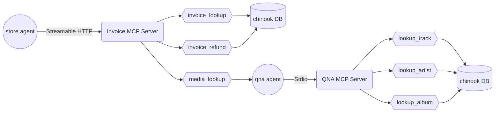

# NIM challenge

## overview

In this challenge, you will modify an existing workflow for a music store agent to utilise the Model Context Protocol (MCP).  

From the challenge, participants should be able to
1) create MCP servers utilising the low level python sdk
2) package MCP servers into a format reusable by any MCP client
3) craft workflows with human-in-the-loop through langgraph
4) utilise Nvidia NIMs as the LLM backbone in agentic workflows

The original workflow is as follows (source: [langchain agent evaluation](https://docs.smith.langchain.com/evaluation/tutorials/agents)).


There are 3 main parts, 
1) the intent classifier, 
2) the question answering (qna) agent for handling general music queries and
3) the refund agent for processing refund requests.

The task is to 
1) Allow human intervention if intent is unknown, 
2) convert both the qna and refund agents into its respective MCP server and 
3) merge both qna and refund agents into a single "store agent" that utilises both MCP servers.

The resulting workflow is as follows.


The store agent connects to the invoice MCP server to answer customer queries.

The invoice MCP server provides access to the below tools
1) invoice search (by querying the chinook DB)
2) invoice refund (by querying the chinook DB)
3) media search (invokes the qna agent that connects to the qna MCP server)

Note:  
The media search tool is an example of agent to agent communication in the form of *agent as a tool*. This is still an area of the protocol that is actively [discussed](https://github.com/modelcontextprotocol/modelcontextprotocol/discussions/330).

The qna MCP server provides access to the below tools
1) track search (by querying the chinook DB)
2) album search (by querying the chinook DB)
3) artist search (by querying the chinook DB)

Components of the store agent:



## Assignment

The following folders/files for mcp-servers have been provided to you.  
The task is to complete the code in the following python files.  

1) mcp-servers/invoice/src/mcp_server_invoice/qna_agent.py  
This can be any agentic framework including [autogen](https://github.com/microsoft/autogen), [crewai](https://github.com/crewAIInc/crewAI), [adk](https://github.com/google/adk-python) etc.  
For this exercise, we opt to use [pydantic-ai](https://github.com/pydantic/pydantic-ai).  
2) mcp-servers/invoice/src/mcp_server_invoice/server_http.py
3) mcp-servers/qna/src/mcp_server_qna/server.py

**Do not install any new dependencies.**   
**Do not change any of the file/folder names**  
**Do not change any of the class/function headers**
**Do not change the model id**

```
mcp-servers
├── invoice
│   ├── README.md
│   ├── data
│   │   └── chinook.db
│   ├── pyproject.toml
│   ├── src
│   │   └── mcp_server_invoice
│   │       ├── __init__.py
│   │       ├── qna_agent.py
│   │       └── server_http.py
│   └── uv.lock
└── qna
    ├── README.md
    ├── data
    │   └── chinook.db
    ├── pyproject.toml
    ├── src
    │   └── mcp_server_qna
    │       ├── __init__.py
    │       └── server.py
    └── uv.lock
```

The following folders/files for the llm workflow have been provided to you.  
The task is to complete the code in the following python files.  

1) llm_workflow/main.py
2) llm_workflow/mcp_http_client.py

**Do not install any new dependencies.**   
**Do not change any of the file/folder names**  
**Do not change any of the class/function headers**
**Do not change the model id**

```
llm_workflow
├── README.md
├── __init__.py
├── main.py
├── mcp_http_client.py
├── pyproject.toml
└── uv.lock
```

## Testing your solution

You can use the following to test your solution locally before submission.  
The test cases are minimal and you should add in more on your own.  

[mcp server qna test](./mcp-server-qna-test/)
[mcp server invoice test](./mcp-server-invoice-test/)
[llm workflow test](./llm-workflow-test/)

## Submission

To submit, 

1) Create submission.zip by running the following script

```bash
./create-zip.sh
```

submission.zip contains only the required editable python files.

Folder structure of zip archive as follows.

```bash
submission
├── llm-workflow
│   ├── main.py
│   └── mcp_http_client.py
└── mcp-servers
    ├── invoice
    │   ├── qna_agent.py
    │   └── server_http.py
    └── qna
        └── server.py
```

2) upload the zip archive to submit your solution.

