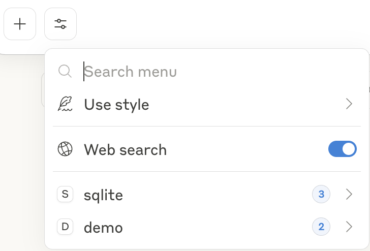
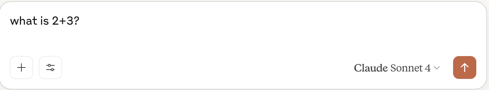
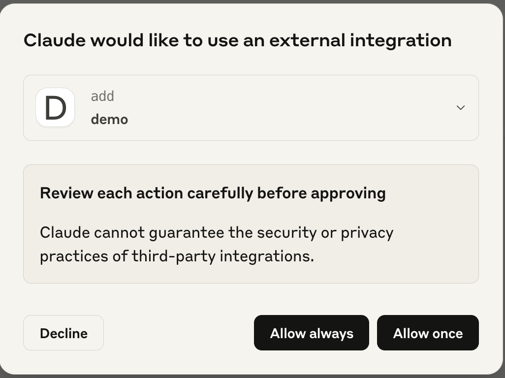
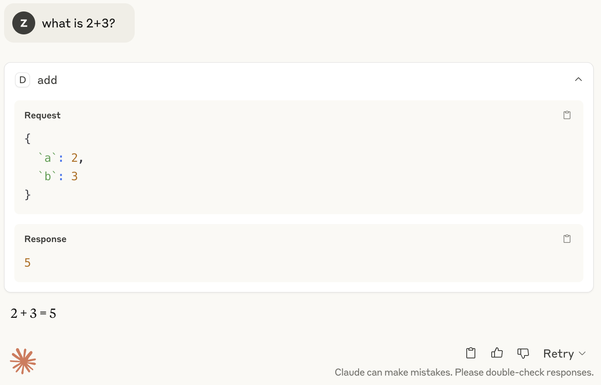
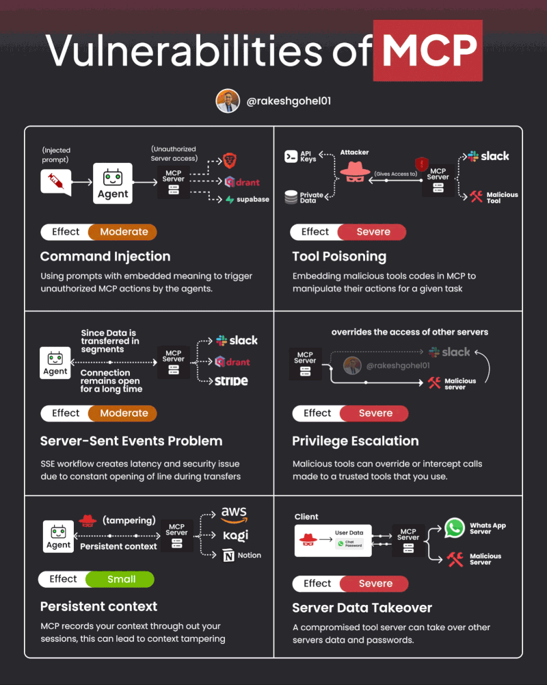

# Model Context Protocol (MCP)

## Examples

Go through the below examples in order to understand the basic workings of the MCP protocol.  

### MCP Server

1. Example of a stdio MCP Server using the high level SDK (fastmcp)

    Refer to [mcp-server-demo](./mcp-server-demo/server.py).  
    This mcp server enables simple addition and subtraction of 2 integers.  

2. Example of a stdio MCP Server using the low level SDK

    Refer to [mcp-server-low-level-demo](./mcp-server-demo/server_low_level.py).  
    Compared to the high level SDK, the low level SDK allows you
    * Maximum control over protocol behavior
    * Custom transport implementations
    * Implementation of non standard features  

    An example of a useful low level mcp server that enables querying of an sqlite database through natural language can be found [here](https://github.com/modelcontextprotocol/servers-archived/blob/main/src/sqlite).  

3. Example of a Streamable HTTP MCP Server using the high level SDK (fastmcp)

    Refer to [mcp-server-http-demo](./mcp-server-demo/server_http.py).  
    This is a 'real server' that can be run remotely.  
    The mcp servers based on stdio are actually background processes that run locally.

4. Example of a Streamable HTTP MCP Server using the low level SDK (fastmcp)

    Refer to [mcp-server-http-low-level-demo](./mcp-server-demo/server_http_low_level.py).  
    This is a 'real server' that can be run remotely.  
    The mcp servers based on stdio are actually background processes that run locally.

### MCP Client

1. Example of a MCP Client that invokes the MCP Servers created above

    Refer to [mcp-client-demo](./mcp-client-demo/client.py).  
    This mcp client initializes the mcp servers created above, lists the tools and calls the tools.  

2. Claude for Desktop

    You can connect Claude for Desktop to the MCP server by using the below configuration.

    ```bash
    "Demo": {
        "command": "uv",
        "args": [
        "run",
        "--with",
        "mcp[cli]",
        "mcp",
        "run",
        "<project_folder>/mcp-server-demo/server.py"
        ]
    }
    ```

    In claude for Desktop, you can place this in claude_desktop_config.json.  
    You should see the tool 'Demo' available in the UI.
    

    You can now test out a prompt that utilises the tool.  
    E.g. what is 2+3?

    

    Allow tool calling

    

    Output

    

    #### Note:

    **There is a token limit for the free plan.**

    You can test your MCP Servers for the assignment using a similar setup.

    You can also generate synthetic test cases to test your workflow and MCP Servers.  
    A convenient approach is to allow Claude for Desktop to read the database schema through [sqlite mcp server](https://github.com/modelcontextprotocol/servers-archived/blob/main/src/sqlite) and using your created MCP server to return sample output.

### More examples

Refer to the [official mcp python sdk](https://github.com/modelcontextprotocol/python-sdk/tree/main) for more examples and features.

## Vulnerabilities

The MCP protocol is not perfect and does come with a set of well known vulnerabilities.  
Make sure to validate external/3rd party MCP Servers before using them.  
Below's an illustration courtesy of [Rakesh Gohel](https://www.linkedin.com/in/rakeshgohel01).  
